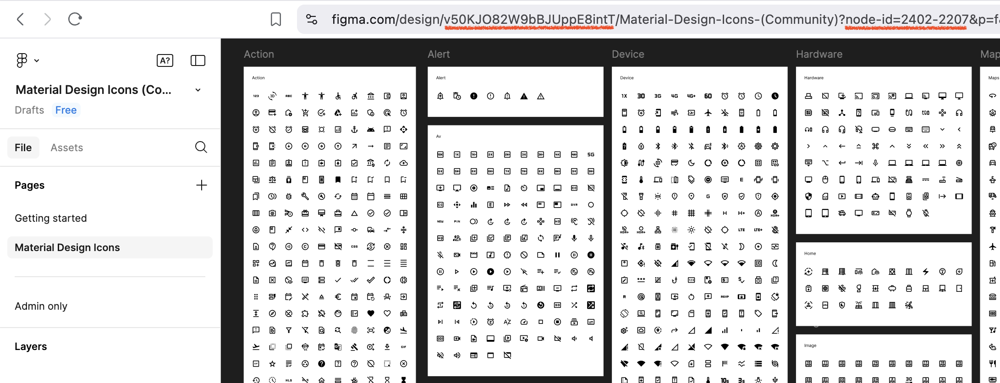
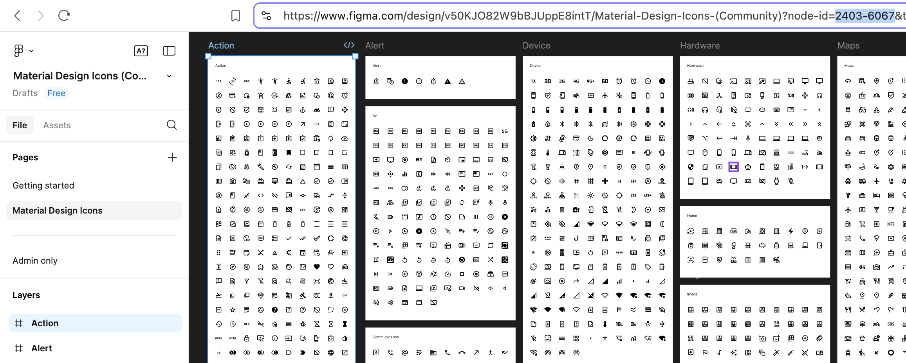
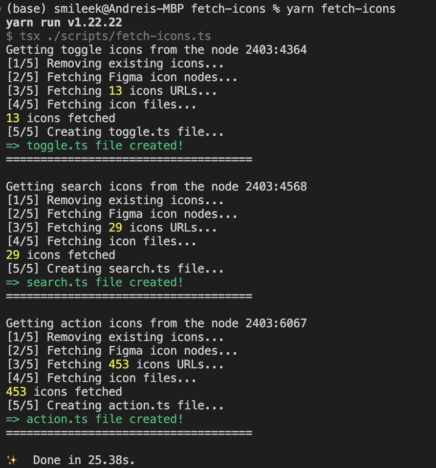

# Fetch icons from Figma

This is an example react project that fetches [Material Design Icons (Community)](<https://www.figma.com/design/v50KJO82W9bBJUppE8intT/Material-Design-Icons-(Community)>) and utilize them in the `MyIcon` component.

If you want to use it for your own Figma project, follow the next steps:

1. Add the `VITE_FIGMA_PERSONAL_ACCESS_TOKEN` to your `.env` file (read [this](https://help.figma.com/hc/en-us/articles/8085703771159-Manage-personal-access-tokens) if you don't know how to get one).

2. Add the `fetch-icons.js` or `fetch-icons.ts` file to your project.

   > 2.1. JS version only requires nodeJS installed. If you use the TS version, add the dependencies (I use `yarn`, and I'm sure you know how to do it with your favourite package manager):
   >
   > ```bash
   >  yarn add -D tsx axios @figma/rest-api-spec
   > ```

3. Update the `FILE_KEY`, `ICONS_FOLDER` and `iconSets`



```js
const FILE_KEY = "v50KJO82W9bBJUppE8intT";

const ICONS_FOLDER = "../src/assets/icons";

//...

const iconSets = {
  index: "2402-2207", // "index" is a file name that we'll use for this set
};
```

4. If your icon set is too big and you want to split it, click on the child frames and get their node ids (the URL will update each time you choose one):



```js
const iconSets = {
  toggle: "2403-4364",
  search: "2403-4568",
  action: "2403-6067",
};
```

This will create three separate files: `toggle.ts`, `search.ts` and `action.ts`.

> Please note, that `fetch-icons.js` also creates TypeScript files, it's just that it doesn't require any additional dependencies. If you want to create `.js` files, consider cleaning up the strings that are added to the `fileContent` array, and updating the `fileName` variable at the beginning of the `getImagesFromFrame` function.

5. Run the script

```bash
yarn node ./scripts/fetch-icons.js
```

or

```bash
yarn tsx ./scripts/fetch-icons.ts
```

Or create an entry in your `package.json` and run `yarn fetch-icons` instead

```json
"fetch-icons": "tsx ./scripts/fetch-icons.ts"
```

6. If everything goes well, you'll see something like this:



otherwise, refer to the logs to find an issue.

## License

Feel free to use those scripts in your personal and/or commercial projects, whether modified or not. However, the author doesn't hold any responsibility for any issues this can result in. I cannot imagine how is it even possible, but still don't want to be responsible if you manage to cause any harm using it.
